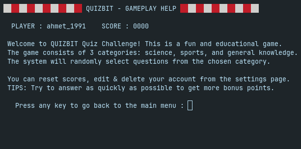
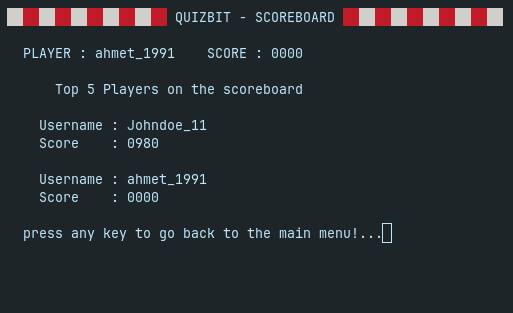
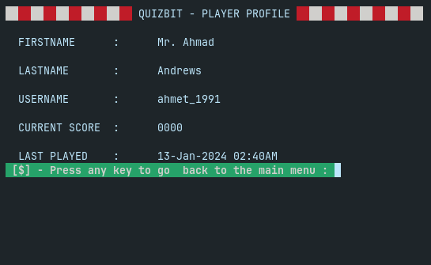
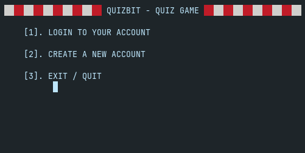
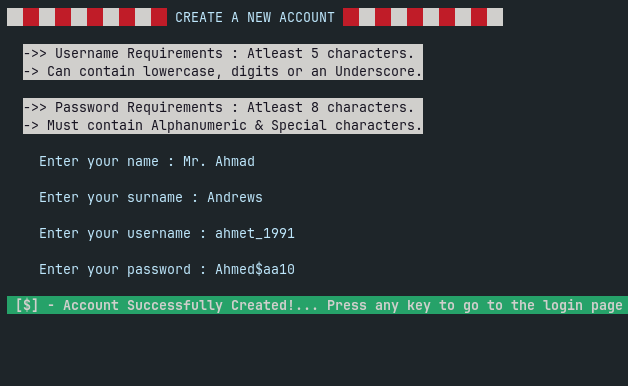
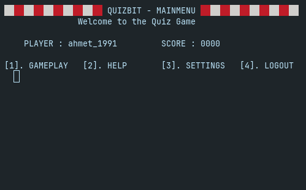
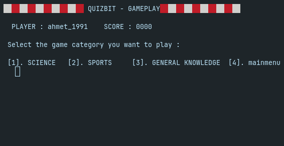

# QUIZBIT - QUIZ CHALLENGE

This project is a simple & fun Terminal based Quiz Game written in C.
___

**Table of Contents**
1. [Project Description](#project-description)
2. [Installation Instructions](#installation-instructions)
3. [Usage Guide](#usage-guide)
4. [Data Storage](#data-storage)
5. [Categories and Questions](#categories-and-questions)
6. [Contributing Guidelines](#contributing-guidelines)
7. [License Information](#license-information)

## Project Description
The game tests your knowledge in three categories: Science, Sports, and General Knowledge. To participate, users can either log in or sign up to their account. Account informations are stored in an sqlite database file. In addition to tracking user information, the game also maintains a record of each player's scores.

## Installation Instructions
> **Requirements :** *gcc compiler, git, sqlite3, & openssl*.

To run the Terminal Quiz Game on your system, follow these steps:

- [X] **Clone the Repository :**
```bash
git clone https://github.com/mrmas-io/quizbit.git
```
- [X] **Build The Project:**
```bash
make
```
- [X] **Run The Project:**
```bash
make run
```
- [X] **Clean The Make Files**
```bash
make clean
```

``Follow the on-screen instructions to create an account, log in, and enjoy the quiz.``

## Usage Guide
- ### The Quiz Game is user-friendly and offers the following features:
  - 
- **Sign Up**: New users can create an account with a unique username and password.
- **Log In**: Registered users can log in with their credentials.
- **Choose a Category**: Select from Science, Sports, or General Knowledge quizzes.
- **Answer Questions**: The game will present random questions from the chosen category.
- **Score Tracking**: Your scores are recorded and can be viewed in your profile.
  - 
- **Account Management:** You can view your profile, edit and delete your profile.
  - 

For example, to create an account and play the quiz, follow these steps:

1. Run the application.
   - 
2. Choose "Sign Up" and follow the prompts to create an account.
   - 
3. Log in with your newly created account.
4. Select a quiz category.
5. Answer the quiz questions and track your score.

|                                             |                                             |
|---------------------------------------------|---------------------------------------------|
|  |  |

## Data Storage
The project uses an sqlite3 database to store user/player account information and the quiz question & answer information.

## Categories and Questions
The quiz game features three categories: Science, Sports, and General Knowledge. Questions for each category are organized and randomly presented to the player to keep the game engaging.
- 
## Contributing Guidelines
We welcome contributions to the project. If you'd like to contribute, please follow these steps:
1. Fork the repository.
2. Create a new branch for your feature or bug fix.
3. Make your changes and ensure all tests pass.
4. Submit a pull request.
5. Your contribution will be reviewed and merged.

## License Information
This project is licensed under the [MIT License](LICENSE). You are free to use, modify, and distribute this software in accordance with the terms of the license.
